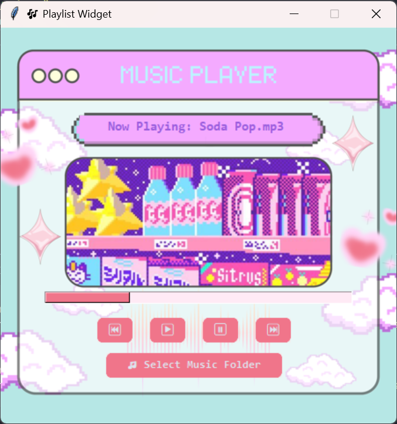

# 🎵 Playlist Widget Music Player

A retro-pixel-themed Python music player app built with Tkinter and Pygame — featuring a custom-designed background, interactive audio controls, and a fully functional progress bar!

> ✅ Designed with Object-Oriented Programming (OOP) principles  
> ✅ Modular code (split into `main.py`, `core/`, `views/`)  
> ✅ Custom background and buttons styled in pastel pixel art  
> ✅ Clickable progress bar for seeking  

---

## 🖼️ Preview




---

## 🚀 Features

- 🎨 Fixed-size retro UI with Canva-designed background
- 🎶 Play, pause, skip forward/backward between `.mp3` files
- 📂 Select your own folder of songs to load dynamically
- 📊 Progress bar that tracks playback and is clickable for seeking
- 🧠 Built with OOP: abstraction, encapsulation, inheritance, and polymorphism

---

## 💻 Installation

### 🐍 Prerequisites:
Make sure Python 3.8+ is installed. Then install the following packages:

```bash
pip install pygame mutagen customtkinter pillow
````

---

## 🧠 How to Run

1. Clone or download this repository.
2. Make sure your background image (`bg.png`) is in the `assets/` folder.
3. Run the app from `main.py`:

```bash
python main.py
```

4. Once the app opens:

   * Click **🎵 Select Music Folder**
   * Choose any folder with `.mp3` files
   * Your first song will auto-play!
   * Use the audio control buttons to pause/play/skip
   * Click the progress bar to seek through the track

---

## 📁 Folder Structure

```
├── main.py                  # Entry point
├── app.py                   # App initializer
├── assets/
│   └── bg.png               # Background image
├── core/
│   ├── audio_player.py      # Handles audio logic (encapsulation)
│   └── utils.py             # Progress bar thread (abstraction)
└── views/
    └── playlist_view.py     # UI logic (playlist widget GUI)
```

---

## 🎓 Object-Oriented Design

| Pillar        | Example                                                      |
| ------------- | ------------------------------------------------------------ |
| Abstraction   | `start_progress_thread()` to hide threading logic            |
| Encapsulation | Audio logic managed in `AudioPlayer` with private attributes |
| Inheritance   | CustomTkinter buttons extend base `tkinter` widgets          |
| Polymorphism  | Overridden behavior for play/resume based on player state    |

---

## 📌 Notes

* The progress bar works only for `.mp3` files.
* Make sure your songs do not have DRM or unsupported formats.
* The background image should be **450x450px** for proper alignment.

---

## 📷 Credits

* 🎨 UI Background: Designed in Canva by \[Chariz Kyle Santos]
* 🧠 Source Code: achudnova and Modified by: \[Chariz Kyle Santos]
* 💻 Built with: Python, Tkinter, Pygame, CustomTkinter, Mutagen, Pillow